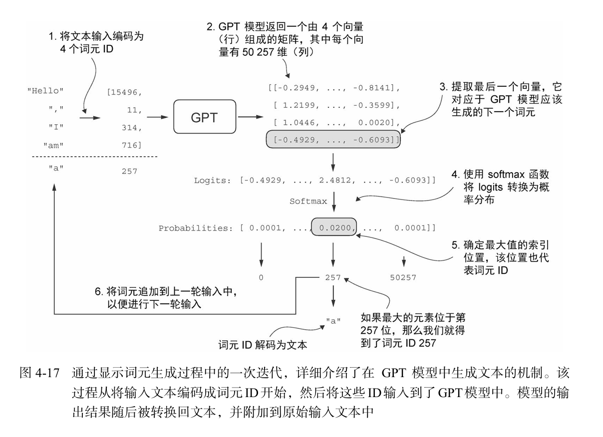
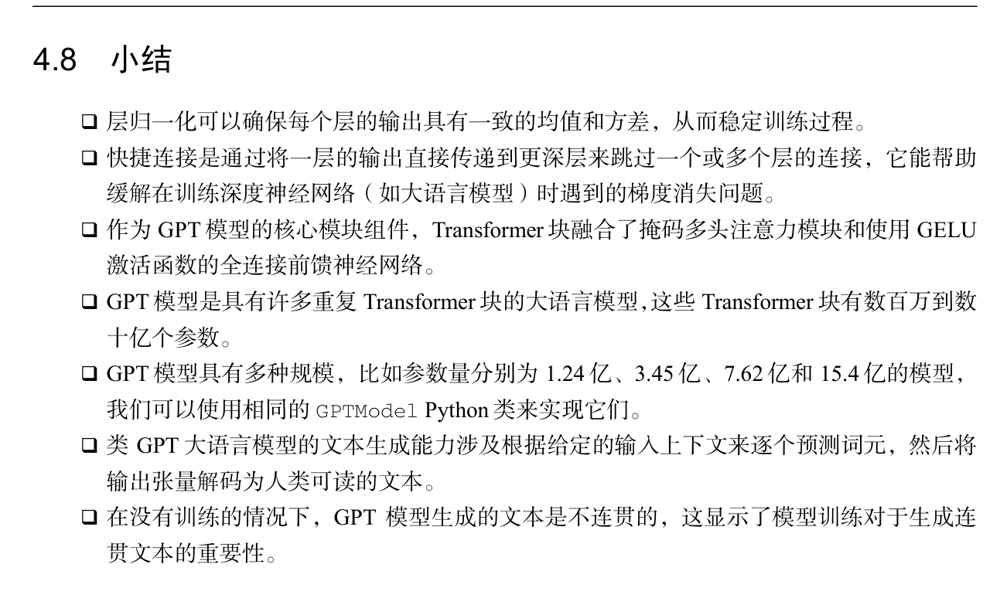

## 这段话是在解释 Transformer 块的一个关键特性：

**输入和输出的形状（维度）相同，但每个输出向量的语义内容却包含了整个输入序列的全局信息**。下面逐步拆解解释。

---

### 1. “在整个 Transformer 块架构中保持形状不变并非偶然”

- 在 Transformer 块中，输入是一个序列，形状通常为 `(batch_size, seq_len, emb_dim)`。经过自注意力层、前馈网络、残差连接和层归一化后，输出的形状**完全相同**。
- 这不是巧合，而是刻意设计：确保模型可以**堆叠任意多个 Transformer 块**而无需调整维度，同时保持每个时间步的独立输出，便于后续处理（如逐 token 分类或生成）。

---

### 2. “这种设计使其能有效应用于各种序列到序列的任务，其中每个输出向量直接对应一个输入向量，保持一一对应的关系”

- 在机器翻译、文本摘要等序列到序列（seq2seq）任务中，通常需要为每个输入位置生成一个对应的输出（例如翻译后每个词的位置对齐）。
- Transformer 块输出与输入形状相同，使得**每个输出位置的向量可以直接对应于输入序列中同一位置的 token**。这种一一对应关系便于构建编码器-解码器注意力或进行逐标签预测（如词性标注）。

---

### 3. “然而，输出是一个包含整个输入序列信息的上下文向量”

- 虽然输出向量的物理位置与输入一一对应，但经过自注意力机制后，**每个输出位置的向量不仅仅编码了对应输入 token 的信息，还聚合了整个序列的上下文**。
- 具体来说，自注意力让每个 token 都能“看到”序列中所有其他 token，并通过加权求和生成新的表示。因此，输出向量 `y_i` 包含了全序列的信息，而不仅仅是 `x_i`。

---

### 4. “序列的物理维度（长度和特征尺寸）保持不变，但每个输出向量的内容都要重新编码，以整合来自整个输入序列的上下文信息”

- **物理维度不变**：序列长度 `seq_len` 和特征维度 `emb_dim` 在通过 Transformer 块前后相同。
- **内容重新编码**：虽然形状没变，但每个向量的数值已经被自注意力和前馈网络重新计算，融入了全局上下文。这意味着同一个位置的向量，输入时只代表自身，输出时却“看到”了整个序列。

---

### 举例理解

假设输入句子：“我 爱 北京 天安门”。每个词对应一个向量。

- 输入时，第一个词“我”的向量只包含自身信息。
- 经过 Transformer 块后，输出中第一个位置的向量不仅包含“我”的信息，还融入了“爱”、“北京”、“天安门”的上下文，从而知道“我”是热爱某物的主体。
- 但序列长度仍然是 4，每个位置仍然有一个向量。这就是形状不变，但内容已经全局化。

---

### 总结

这句话的核心思想：Transformer 块在保持输入输出形状相同（便于堆叠和对齐）的同时，通过自注意力机制让每个输出向量都“看遍”整个序列，实现局部与全局信息的融合。这种设计兼顾了**结构的规律性**和**表示的丰富性**。


### 最后一维是高维是啥意思：最终 Transformer 块的输出会经过最后一步的层归一化处理，然后传递到线性输出层。这 个层会将Transformer的输出映射到一个高维空间（在本例中为50 257维，对应模型的词汇表 大小），以预测序列中的下一个词元。

“最后一维是高维”是指：经过 Transformer 块处理后，模型输出的最后一个维度（特征维度）被映射到了**词汇表大小**的维度。在 GPT-2 的例子中，词汇表大小为 50257，因此输出形状为 `(batch_size, seq_len, 50257)`。

这个维度之所以被称为“高维”，是因为相对于 Transformer 内部的特征维度（例如 768 或 1024），词汇表大小通常大得多（几万甚至几十万）。所以最后一维是模型输出中最宽的一个维度，其每个元素代表下一个词元（token）的未归一化分数（logit）。

具体来说：
- 模型的任务是预测下一个词元。为此，需要为词汇表中每个可能的词元计算一个分数，分数最高的词元就是预测结果。
- 线性输出层（通常是一个不带偏置的全连接层）将 Transformer 的最后一层输出（维度为 `emb_dim`，例如 768）映射到 `vocab_size` 维（例如 50257）。这个映射本质上是将每个位置的语义向量“解码”为整个词汇表上的概率分布。
- 由于词汇表通常很大（英文 GPT-2 有 50257 个词元），所以这个输出维度自然就是高维的。

这个高维输出正是语言模型进行逐词预测的基础：我们可以通过 softmax 将其转换为概率分布，然后采样或取最大概率的词元作为下一个预测。

### 这句话什么意思：这个映射本质上是将每个位置的语义向量“解码”为整个词汇表上的概率分布。

这句话的意思是：在 Transformer 模型中，最后一个线性层（输出层）将每个位置经过多层编码后的**语义向量（隐藏状态）**，通过一次线性变换（矩阵乘法），转换成一个维度等于**词汇表大小**的向量，再经过 softmax 就得到了**整个词汇表上的概率分布**（每个词的概率）。这个过程被称为“解码”，因为它从抽象的连续向量空间“翻译”回离散的词元空间，用于预测下一个词。

### 分步解释

1. **每个位置的语义向量**  
   Transformer 块的输出是一个形状为 `(batch_size, seq_len, d_model)` 的三维张量。其中每个位置（`seq_len` 维）对应一个长度为 `d_model`（例如 768）的向量，这个向量经过了自注意力、前馈网络等层层变换，已经融合了该位置及其上下文的语义信息。这就是“语义向量”。

2. **线性映射（解码）**  
   一个线性层（`nn.Linear(d_model, vocab_size, bias=False)`）将这个 `d_model` 维的语义向量投影到 `vocab_size` 维（例如 GPT-2 的 50257）。数学上，输出 = 输入 × 权重矩阵 + 偏置。这个矩阵的行数是 `vocab_size`，列数是 `d_model`，本质上是一个从语义空间到词元空间的线性变换。

3. **产生概率分布**  
   线性层的输出（通常称为 logits）是未经归一化的分数，数值可正可负，大小表示模型认为每个词元适合作为下一个词的程度。随后，对这些 logits 应用 **softmax** 函数，将它们转换为一个概率分布：每个词的概率在 0 到 1 之间，且所有词的概率之和为 1。最终，模型可以根据这个概率分布来采样或选择概率最高的词作为预测结果。

### 举例说明

假设当前位置要预测下一个单词。语义向量是 `[0.2, -0.5, 0.7, …]`（768 维）。线性层将其映射成 50257 维的 logits，其中“苹果”对应的位置得分最高（例如 10.2），“香蕉”得分较低（-1.3），“汽车”得分中等（2.1）。softmax 后，“苹果”的概率可能是 0.95，其他词概率很小。这样就完成了从语义到具体单词的“解码”。

### 为什么说“解码”？

- **编码**：将离散的词元（token ID）通过词嵌入层映射为连续向量。
- **解码**：将经过处理的连续向量再映射回离散的词元空间，并给出概率分布。这与编码过程相反，因此称为“解码”。它和传统的编码器-解码器架构中的“解码器”概念类似，但这里是在同一模型中通过线性层实现。

总结：这句话形象地描述了 Transformer 语言模型预测下一个词的核心步骤：**用语义向量来生成词汇表上的一个概率分布，从而决定输出哪个词**。


## 模型将输出张量转化为生成文本的过程涉及多个步骤




## 这是一个典型的**自回归文本生成**函数generate_text_simple

用于在训练好的 GPT 类模型上逐步生成新词元（token）。下面逐行详细解释。

---

### 函数签名
```python
def generate_text_simple(model, idx, max_new_tokens, context_size):
```
- **model**：已训练好的语言模型（如 GPT），能够接收 token 索引序列并输出 logits。
- **idx**：初始上下文 token 索引，形状为 `(batch, n_tokens)`。例如 `[[610, 786, 1298]]` 表示一个样本（batch=1）的起始序列。
- **max_new_tokens**：要生成的新词元数量（不包括已有上下文）。
- **context_size**：模型支持的最大上下文长度（即位置嵌入的最大序列长度，如 GPT-2 的 1024）。

---

### 循环：生成 `max_new_tokens` 个词元
```python
for _ in range(max_new_tokens):
```
每一步生成一个词元，然后将其追加到序列末尾，作为下一步的输入。

---

#### 1. 裁剪当前上下文
```python
idx_cond = idx[:, -context_size:]
```
- 如果当前序列长度 `n_tokens` 超过了模型支持的 `context_size`，则只保留最后 `context_size` 个词元。
- 例如：`context_size = 5`，但 `idx` 的长度已经是 10，则只取最后 5 个。这是必须的，因为模型的位置嵌入表大小有限，无法处理超过 `context_size` 的输入。
- 切片操作在所有 batch 样本上同时进行。

---

#### 2. 模型前向传播（不计算梯度）
```python
with torch.no_grad():
    logits = model(idx_cond)
```
- `idx_cond` 形状：`(batch, seq_len)`，其中 `seq_len = min(n_tokens, context_size)`。
- 模型输出 `logits` 形状：`(batch, seq_len, vocab_size)`，表示每个位置、每个词元的未归一化分数。

---

#### 3. 只取最后一个时间步的预测
```python
logits = logits[:, -1, :]   # 形状变为 (batch, vocab_size)
```
- 在自回归生成中，我们只关心**预测序列中的下一个词元**。因此只取最后一个位置的 logits（对应输入序列中最后一个词元后的预测）。
- 这相当于：模型根据当前已知的所有词元，预测紧随其后的那个词元。

---

#### 4. 转换为概率分布
```python
probas = torch.softmax(logits, dim=-1)   # (batch, vocab_size)
```
- softmax 将 logits 转换为概率分布，所有词元的概率之和为 1。

---

#### 5. 贪心采样：选择概率最高的词元
```python
idx_next = torch.argmax(probas, dim=-1, keepdim=True)   # (batch, 1)
```
- `argmax` 返回最大概率对应的索引（即词元 ID）。
- `keepdim=True` 保持维度为 `(batch, 1)`，方便后续拼接。

---

#### 6. 将新词元追加到序列末尾
```python
idx = torch.cat((idx, idx_next), dim=1)   # (batch, n_tokens+1)
```
- 将新生成的词元按列（时间步维度）拼接到原序列后，序列长度增加 1。

---

### 循环结束后
```python
return idx
```
- 返回最终生成的完整序列（原始上下文 + 新生成的 `max_new_tokens` 个词元），形状为 `(batch, n_tokens + max_new_tokens)`。

---

### 关键点总结

| 步骤                  | 作用                                     |
| --------------------- | ---------------------------------------- |
| 裁剪上下文 `idx_cond` | 防止序列长度超出模型支持的最大长度       |
| `model(idx_cond)`     | 计算所有位置的 logits                    |
| `logits[:, -1, :]`    | 只取最后一步的预测，用于生成下一个词元   |
| `softmax`             | 将 logits 转换为概率分布                 |
| `argmax`              | 贪心选择概率最高的词元（也可用采样代替） |
| `torch.cat`           | 将新词元追加到序列，实现自回归扩展       |

---

### 示例

假设：
- `batch = 1`，初始 `idx = [[610, 786]]`（两个词元）。
- `context_size = 5`，`max_new_tokens = 3`。

生成过程：
1. 输入 `[[610, 786]]` → 模型预测下一个词元，`argmax` 得到 `[[1298]]` → 序列变为 `[[610, 786, 1298]]`。
2. 输入 `[[610, 786, 1298]]` → 预测得到 `[[345]]` → 序列变为 `[[610, 786, 1298, 345]]`。
3. 输入 `[[610, 786, 1298, 345]]` → 预测得到 `[[421]]` → 序列变为 `[[610, 786, 1298, 345, 421]]`。

返回的 `idx` 长度为 5（原始 2 + 新生成 3）。

---

### 注意事项

- 本函数使用**贪心解码**（`argmax`）。实际文本生成常使用**温度采样**、**top‑k** 或 **top‑p** 来增加多样性。
- 如果初始 `idx` 的序列长度已经超过 `context_size`，裁剪可能会导致丢失较早的上下文信息，影响生成质量。通常使用时保证初始序列长度 ≤ `context_size`。
- `model` 的输出必须是 `(batch, seq_len, vocab_size)` 形状，且已训练好。
- 该函数不返回概率或注意力权重，仅返回生成的 token 索引序列。如需解码为文本，还需配合分词器的 `decode` 方法。


## `with torch.no_grad():`

 是 PyTorch 中用于**禁用梯度计算**的上下文管理器。在此代码块内的所有操作，PyTorch 不会构建计算图，也不会跟踪张量的历史记录，因此无法对这些张量调用 `.backward()` 进行反向传播。

### 主要作用

- **减少内存消耗**：不保存中间激活值，大幅降低显存/内存占用。
- **加速计算**：避免不必要的梯度计算开销。
- **用于推理/评估**：在模型评估、预测或生成文本时，不需要梯度，因此使用 `torch.no_grad()` 是标准做法。

### 示例对比

```python
x = torch.randn(1, 3, requires_grad=True)

# 正常情况下会记录梯度
y = x * 2
print(y.requires_grad)  # True

with torch.no_grad():
    y = x * 2
    print(y.requires_grad)  # False
```

### 在生成函数中的应用

在你提供的 `generate_text_simple` 函数中：

```python
with torch.no_grad():
    logits = model(idx_cond)
```

模型前向传播时不需要梯度，因为生成过程只涉及前向计算，不需要反向传播更新参数。使用 `torch.no_grad()` 可以节省显存并加速推理，特别适合生成长序列文本的场景。

### 等效写法

```python
@torch.no_grad()
def generate_text_simple(...):
    # 整个函数都禁用梯度
```

或者使用 `torch.set_grad_enabled(False)` 全局禁用，但 `with torch.no_grad():` 是更精细的局部控制。

**总结**：`with torch.no_grad()` 告诉 PyTorch“在此代码块中不要计算梯度”，这是推理阶段的标准优化技巧。


## 如何将自然语言文本转换为模型可以处理的张量格式

这段代码演示了如何将自然语言文本转换为模型可以处理的张量格式，这是语言模型推理的第一步。下面逐行解释：

---

### 1. 定义起始文本
```python
start_context = "Hello, I am"
```
这是一个字符串，作为生成文本的**起始提示**（prompt）。模型将基于这些初始词元继续生成后续内容。

---

### 2. 编码文本为 Token ID 列表
```python
encoded = tokenizer.encode(start_context)
```
- `tokenizer` 是一个分词器（例如 GPT-2 的 BPE tokenizer，通过 `tiktoken.get_encoding("gpt2")` 获得）。
- `encode` 方法将输入字符串转换为一个整数列表，每个整数对应词汇表中的一个词元（token）。例如 `"Hello, I am"` 可能被拆分为 `["Hello", ",", "I", " am"]`，其 ID 类似于 `[15496, 11, 314, 716]`。
- 输出示例：`encoded: [15496, 11, 314, 716]`（具体数值取决于分词器）。

---

### 3. 打印编码结果
```python
print("encoded:", encoded)
```
显示 token ID 列表，用于调试或观察分词效果。

---

### 4. 转换为 PyTorch 张量
```python
encoded_tensor = torch.tensor(encoded)
```
- 将 Python 列表 `encoded` 转换为 PyTorch 的一维张量（`torch.Tensor`），形状为 `(seq_len,)`，其中 `seq_len` 是 token 的数量（例如 4）。
- 例如 `encoded_tensor` 为 `tensor([15496, 11, 314, 716])`。

---

### 5. 增加 batch 维度
```python
encoded_tensor = encoded_tensor.unsqueeze(0)
```
- `unsqueeze(0)` 在第 0 维（最前面）插入一个维度，将形状从 `(seq_len,)` 变为 `(1, seq_len)`。
- 模型通常要求输入具有 **batch 维度**，即使只有一个样本（batch_size = 1）。这样模型才能正确处理批量数据。
- 结果形状示例：`(1, 4)`。

---

### 6. 打印张量形状
```python
print("encoded_tensor.shape:", encoded_tensor.shape)
```
输出类似 `encoded_tensor.shape: torch.Size([1, 4])`，确认 batch 维度和序列长度。

---

### 完整示例输出

```
encoded: [15496, 11, 314, 716]
encoded_tensor.shape: torch.Size([1, 4])
```

---

### 为什么需要这样处理？

- **模型输入要求**：所有 GPT 类模型（如 GPT‑2、GPT‑3）的 `forward` 方法接受的输入形状都是 `(batch_size, sequence_length)`。
- **批处理一致性**：即使只有一个序列，也要显式添加 batch 维度，保持代码的通用性。
- **后续处理**：这个张量可以直接送入 `generate_text_simple` 或模型的 `forward` 函数，用于自回归生成。

---

### 扩展：反向转换（解码）

如果要将生成的 token ID 转换回文本，可以使用：
```python
decoded_text = tokenizer.decode(encoded_tensor[0].tolist())
print(decoded_text)   # 输出 "Hello, I am"
```

总结：这段代码完成了从原始文本到模型输入的“数据预处理”关键步骤——分词、转张量、增加 batch 维。


## 小结：

